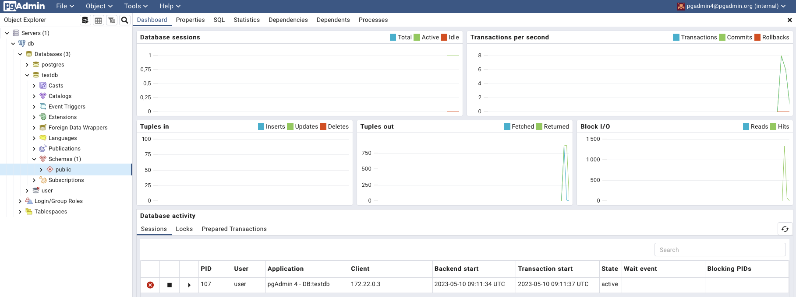

# Отчет о проделанном задании

## Запуск кластера PostgreSQL

1. Предварительно устанавливил Docker Desktop в качестве движка для контейнеризации
2. В файле `docker-compose.yml` сконфигурировал образы, которые буду использовать, их всего два:
   - `postgres` - сервер с базой данных
   - `dpage/pgadmin4` - вебсайт с панелью для управления постгрес
3. Запустил при помощи `$ docker-compose up -d`
   

## Создание пользователя в базе данных

1. Я запустил скрипт `$ bash client/setup.sh` и ввёл пароль `password`
   

## Подключение к pgAdmin

0. Можно видеть, что консоль открылась в браузере (необходимо было подключаться по порту 5555) 
1. Я заранее сконфигурировал дефолтные логин и пароль для панели управления, использовал их для входа
2. Ввёл хост и данные для входа в pgAdmin (от нового созданного пользователя) (Object > Register > Server)
3. Видим базу данных 

## Остановка (и удаление) кластера

1. `$ docker-compose down`
