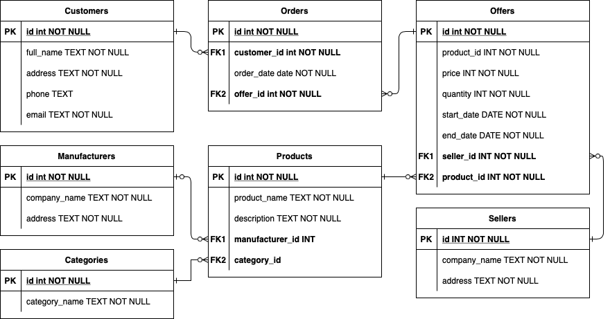
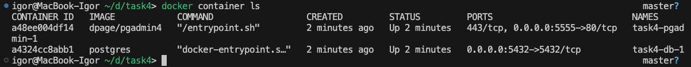
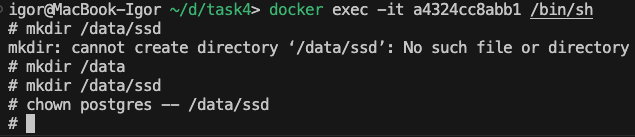
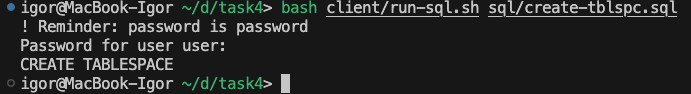
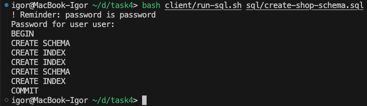
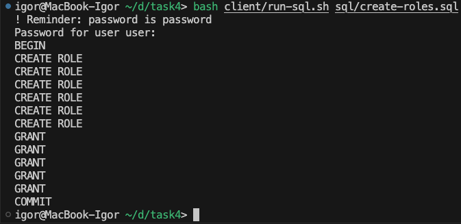
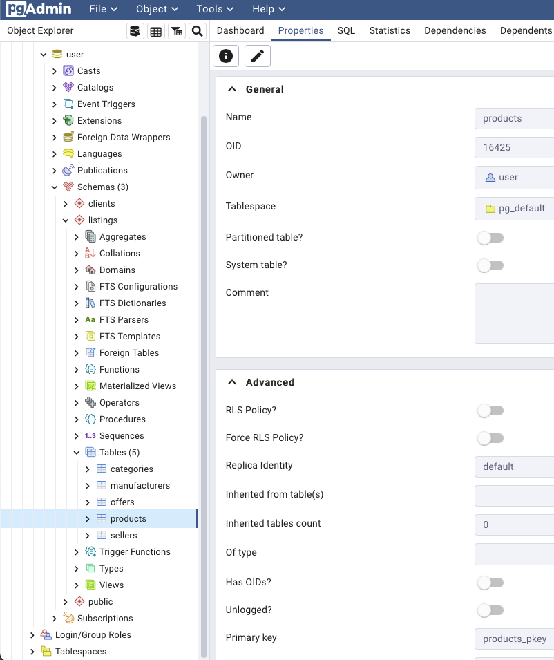

# Отчёт о проделанном задании

## Запуск кластера PostgreSQL и создание пользователя

#### Все шаги повторяют задание №3

## Схема данных (я не успел сдать задание №1 и №2, поэтому прикрепляю сюда)

## Создание табличных пространств

1. В качестве первого шага, необходимо было создать отдельную директорию внутри файловой системы контейнера, и для этого я сделал следующие шаги:
   - `$ docker container ls` 
   - Нашел ID своего контейнера, и сделал следующую последовательность команд: 
2. Запустил `$ bash client/run-sql.sh sql/create-tblspc.sql` 
3. Можно увидеть, что табличное пространство было создано в базе данных

## Создание схем и таблиц, индексов, привязка к табличным пространствам

Я запустил скрипт `$ bash client/run-sql.sh sql/create-shop-schema.sql` и получил результат 

## Создание ролей и пользователей

Я запустил скрипт `$ bash client/run-sql.sh sql/create-roles.sql` и получил результат 

## Результат

